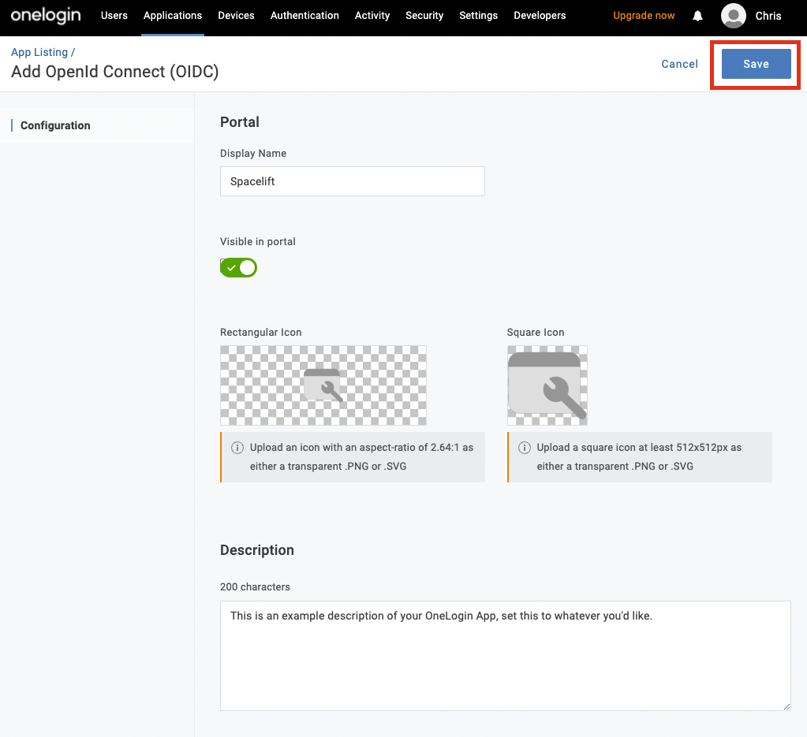
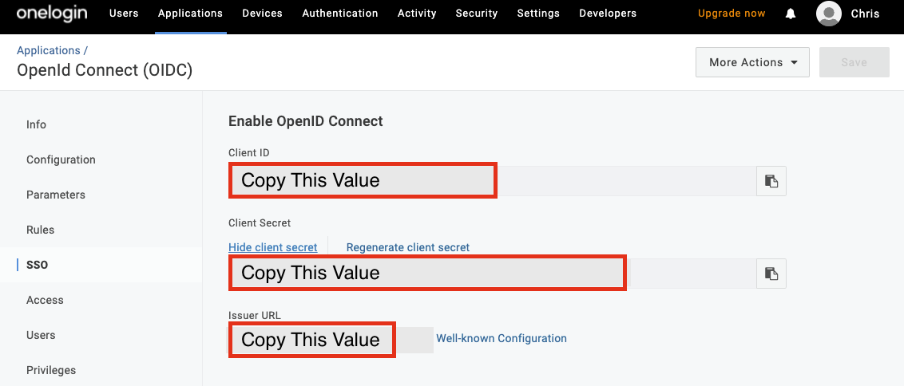
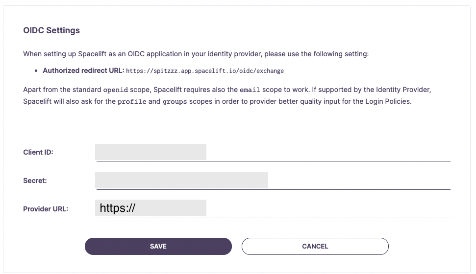

# OneLogin OIDC Setup Guide

## Pre-requisites

- Spacelift account, with access to admin permissions
- OneLogin account, with permission to create OneLogin Applications

## Configure Account Settings

You'll need to visit the Spacelift account settings page to set up this integration, from the account menu, select "Settings."

## Setup OIDC

Next, you'll want to click the Set Up box underneath the "OIDC Settings" section. This will expand some configuration we will need to fill out in a few minutes, which we will be obtaining from OneLogin. For now **copy the authorized redirect URL** as we will need to provide OneLogin this URL when configuring our OneLogin application.

## OneLogin: Select Applications

In a new browser tab, open your OneLogin account and visit the **Administration** page. Select the **Applications** link from the navigation.

## OneLogin: Add Application

Click the **Add App** button.

Search for **OpenId Connect** and select the result as shown.

Give your new OneLogin App a name, Spacelift sounds like a good one :clap:

In regards to "Visible in portal" this is a OneLogin configuration decision that's up to you. In this example, we are enabled this value.

In the app navigation, click on the **Configuration** section. Remember the **authorized redirect URL** we copied earlier from Spacelift? We'll need that in this step. You'll want to paste that URL into the **Login Url** AND **Redirect URI's** input as shown. **Click Save.**

In the app navigation, click on the **SSO** section. Now that we have the OneLogin App setup, we'll need to take the **Client ID**, **Client Secret**, and **Issuer URL**, to configure the Spacelift OIDC Settings

!!! info
    **Important:** You'll need to ensure your OneLogin user has access to the OneLogin App you just created, or else you will receive an unauthorized error when clicking save.

### OneLogin OIDC Setup Completed

That's it! OIDC integration with OneLogin should now be fully configured. Feel free to make any changes to your liking within your OneLogin App configuration.

You'll of course need to configure any users/groups within your OneLogin account to have access to this newly created app.
