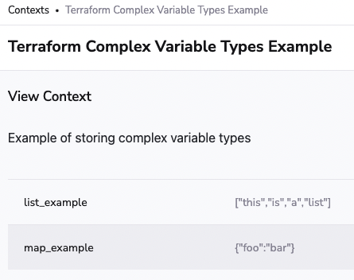

# Storing Complex Variables

Terraform supports a variety of variable types such as `string`, `number`, `list`, `bool`, and `map`. The full list of Terraform's variable types can be found in the Terraform documentation [here](https://www.terraform.io/language/expressions/types).

When using "complex" variable types with Spacelift such as `map` and `list` you'll need to utilize Terraform's [jsonencode](https://www.terraform.io/language/functions/jsonencode) function when storing these variables as an environment variable in your Spacelift Stack [environment](../../concepts/configuration/environment.md) or [context](../../concepts/configuration/context.md).

## Usage Example

```terraform
locals {
  map = {
    foo = "bar"
  }
  list = ["this", "is", "a", "list"]
}

resource "spacelift_context" "example" {
  description = "Example of storing complex variable types"
  name        = "Terraform Complex Variable Types Example"
}

resource "spacelift_environment_variable" "map_example" {
  context_id = spacelift_context.example.id
  name       = "map_example"
  value      = jsonencode(local.map)
  write_only = false
}

resource "spacelift_environment_variable" "list_example" {
  context_id = spacelift_context.example.id
  name       = "list_example"
  value      = jsonencode(local.list)
  write_only = false
}
```

Notice the use of the `jsonencode` function when storing these complex variable types. This will allow you to successfully store these variable types within Spacelift.



## Consuming Stored Variables

When consuming complex variable types in your environment, there is no need to use the `jsondecode()` function.
